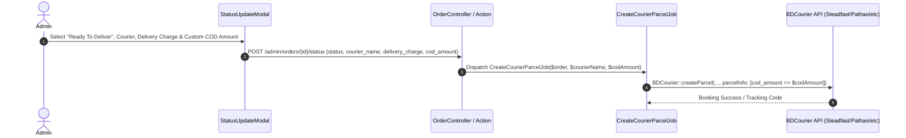

# Custom Cash-on-Delivery (COD) Collection Amount Plan

> [!IMPORTANT]
> **INITIAL PLAN NOTICE**: This document represents the initial architecture plan for handling custom COD collection amounts during order status updates and courier dispatching. As business requirements evolve or during actual implementation, this document should be updated accordingly.

---

## 1. Context & Business Need

In the warehouse and wholesale business model:
- Customers may purchase products on credit or partial due.
- Customers may have previous outstanding balances added to a new shipment.
- Advance payments may be made outside the system.

Currently, when changing an order's status to `Ready To Deliver` in the Admin panel, the courier booking job automatically calculates the COD collection amount as:
$$\text{COD Amount} = \max(0, \text{Grand Total} - \text{Paid Amount})$$

**Issue:** This fixed calculation does not allow administrators to specify a custom COD collection amount for courier dispatch (e.g., collecting ৳1,000 COD for a ৳100,000 order where the remaining ৳99,000 is added to due, or collecting ৳160,000 to include past dues).

---

## 2. Technical Architecture & Modifications

To support custom COD amounts, modifications are required across the backend validation, action pipeline, background job, and frontend admin status modal.

### A. Backend Implementation Plan

#### 1. Request Validation
Modify `app/Http/Requests/Admin/Order/UpdateOrderStatusRequest.php` to validate an optional `cod_amount`:
```php
public function rules(): array
{
    return [
        'status' => ['required', 'string', new Enum(OrderStatusEnum::class)],
        'note' => ['nullable', 'string', 'max:500'],
        'courier_name' => ['nullable', 'string'],
        'delivery_charge' => ['nullable', 'numeric', 'min:0'],
        'cod_amount' => ['nullable', 'numeric', 'min:0'], // Added
    ];
}
```

#### 2. Action Pipeline
Modify `app/Actions/Order/UpdateOrderStatusAction.php` to extract `cod_amount` from the request and pass it to `CreateCourierParcelJob`:
```php
$codAmount = $request->input('cod_amount');

// ... Inside DB transaction ...
if ($newStatus === OrderStatusEnum::READY_TO_DELIVER && !empty($courierName)) {
    \App\Jobs\CreateCourierParcelJob::dispatch(
        $order, 
        $courierName, 
        $codAmount !== null ? (float) $codAmount : null
    );
}
```

#### 3. Courier Booking Job
Modify `app/Jobs/CreateCourierParcelJob.php` constructor and handling logic:
```php
public function __construct(
    public Order $order,
    public string $courierName,
    public ?float $customCodAmount = null // Added optional parameter
) {}

public function handle(): void
{
    // ...
    
    // Use custom COD amount if provided; otherwise fallback to remaining order balance
    $codAmount = $this->customCodAmount !== null 
        ? max(0, (float) $this->customCodAmount) 
        : max(0, (float) $this->order->grand_total - (float) $this->order->paid_amount);

    $parcelInfo = [
        'invoice_id' => $this->order->invoice_no,
        'cod_amount' => $codAmount,
        'weight' => 0.5,
        'note' => 'Handle with care',
    ];
    
    // ...
}
```

---

### B. Frontend Implementation Plan

#### 1. API Interface Update
Modify `frontend/lib/api/orders.ts`:
```typescript
export async function updateOrderStatus(
  id: number,
  payload: {
    status: string;
    note?: string;
    courier_name?: string;
    delivery_charge?: number;
    cod_amount?: number; // Added
  }
): Promise<ApiResponse<any>>
```

#### 2. Status Update Modal UI
Modify `frontend/components/orders/StatusUpdateModal.tsx`:
- Add `codAmount` state initialized to `Math.max(0, (order.grand_total || 0) - (order.paid_amount || 0))`.
- Display an input field for **COD Amount (৳)** when the selected status is `Ready To Deliver`.
- Pass `cod_amount` in the update payload when submitting.

---

## 3. Workflow Summary



---

## 4. Future Considerations & Roadmap (To Be Updated)

1. **Database Persistence**:
   - Store `cod_amount` explicitly in the `order_parcels` table for auditing and reporting.
2. **Accounts & Customer Due Adjustment**:
   - Integrate with customer credit / due ledgers when courier webhook notifications report successful delivery and cash collection.
3. **Multi-Parcel Shipments**:
   - If an order is split into multiple parcels, allow allocating COD amounts per parcel.
