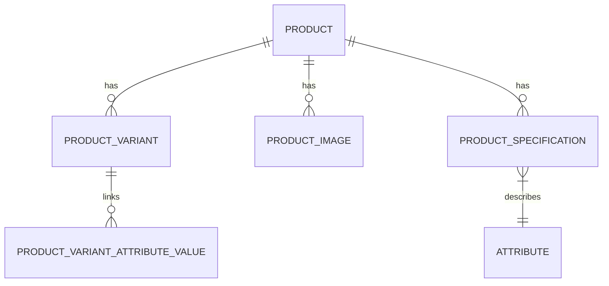

# Product Create & Edit Documentation

This document describes the design, implementation, database associations, and request validation rules for creating and updating products in Bonik OS.

---

## 1. Architectural Overview

Product management logic resides in Action classes under `app/Actions/Product/` rather than directly inside controllers or services. This keeps the controllers thin and ensures database changes occur within isolated transaction boundaries:
- **`CreateProductAction`**: Manages uploading files, storing the product model, assigning specifications, generating product variants, and associating color-specific images.
- **`UpdateProductAction`**: Synchronizes base attributes, handles deletion of removed gallery/color images, uploads new gallery/color images, rebuilds specifications, and synchronizes product variants.

---

## 2. Request Handlers & Validation

The application uses dedicated Form Request classes to validate input. Because product forms contain a mixture of file uploads (thumbnails, galleries, variant color images) and structured attributes, incoming request structures are parsed before validation.

### Data Preparation (`prepareForValidation`)
Form data containing complex nested structures are transmitted as JSON strings. Both requests decode these fields dynamically:
- `specifications`
- `variants`
- `meta_keywords`
- `removed_gallery_images` (Update only)
- `removed_color_images` (Update only)

### Form Requests
- **`StoreProductRequest`**: [StoreProductRequest.php](file:///home/nafis/projects/bonik-os/backend/app/Http/Requests/Vendor/Product/StoreProductRequest.php)
  - `thumbnail` is **required** (image, max 2MB).
  - `variants` must have at least 1 item.
  - Requires `sku`, `price`, and `purchase_price` for each variant.
- **`UpdateProductRequest`**: [UpdateProductRequest.php](file:///home/nafis/projects/bonik-os/backend/app/Http/Requests/Vendor/Product/UpdateProductRequest.php)
  - `thumbnail` is **optional** (allows maintaining existing thumbnail).
  - Validates `removed_gallery_images.*` exists in `product_images.id`.
  - Supports passing specific variant ID (`variants.*.id`) to update in-place.

---

## 3. Database Schema & Relationships

- **`Product`**: Base product model. Belongs to a category, brand, and unit.
- **`ProductVariant`**: Holds actual pricing, SKU, barcode, and inventory levels. Even simple products without options have exactly one default variant.
- **`ProductImage`**: Handles both generic product gallery paths and color-specific product variant images (using `attribute_value` text fields).
- **`ProductSpecification`**: Connects attributes to the product. Supports `text` type attributes (custom value string) and `select`/`multiselect` attributes (associated with `AttributeValue` objects via `predefinedValues` pivot table).

---

## 4. Key Business Logic & Implementation Detail

### Multi-Tenancy / Single-Vendor
This project is a single-vendor application; products belong directly to the global store without any `vendor_id`.

### Storage Paths
Uploaded media are sorted into vendor/product directories:
- Thumbnails: `products/thumbnails`
- SEO/Meta images: `products/seo`
- Galleries: `products/gallery`
- Color variant images: `products/variants`

### Variant Synchronization
Variant updates (`syncVariants` in `UpdateProductAction.php`) behave as follows:
1. **Single-Variant In-Place Update**: If both the database and request contain exactly 1 variant, it updates details in-place.
2. **Multi-Variant Matching**:
   - Variants with submitted IDs are updated. If soft-deleted, they are restored.
   - Variants without IDs or unknown IDs are created as new, and their corresponding attribute options are linked via `ProductVariantAttributeValue`.
   - Remaining variants belonging to the product that were *not* included in the request payload are soft-deleted (`$variant->delete()`).
